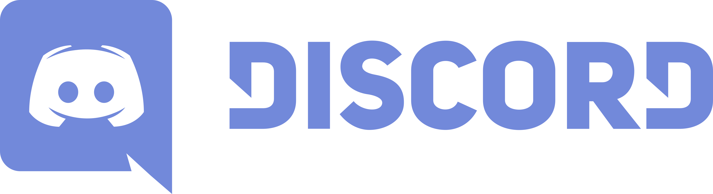
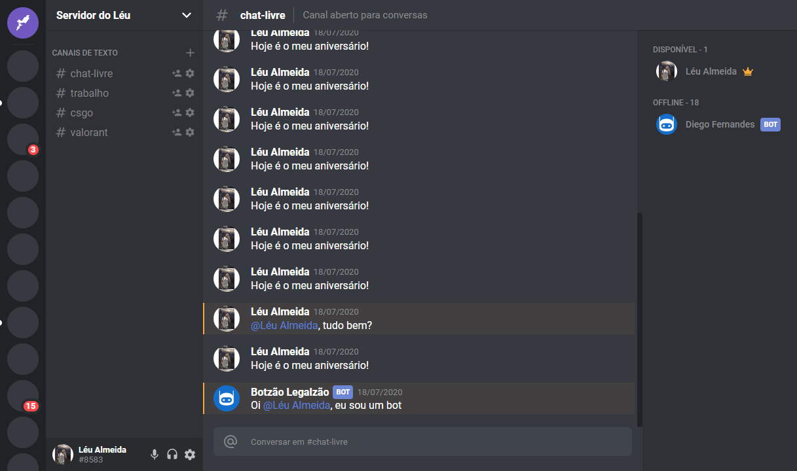

<h1 align="center">
  
</h1>

<h3 align="center">
  Discord Interface Clone
</h3>

<blockquote align="center">
An interface clone created using ReactJS by Léu Almeida with 💜 and :coffee:
</blockquote>

<p align="center">
  

  <a href="https://rocketseat.com.br">
    
  </a>

  

</p>

<p align="center">
  
</p>

<p align="center">
<h3 align="center">
  <a href="https://leunardo.dev/discord" target="_blank">
    ⚡ Live Preview Here ⚡
  </a>
</h3>
</p>

<hr/>

<h3>:heavy_check_mark: About the project</h3>

An interface as faithful as possible, completely componentized and with clean and robust code.

<h3>:electric_plug: Requeriments</h3>

* NodeJS >= 10.16
* Yarn >= 1.21

<h3>:arrows_counterclockwise: Running the application</h3>

```bash
# Clone the project
$ git clone https://github.com/LeuAlmeida/discord-interface.git

# Enter the folder
$ cd discord-interface

# Install the dependencies
$ yarn

## Start the project
$ yarn start
```

<hr/>

<h4 align="center">
<a href="http://linkedin.com/in/leonardoalmeida99">Connect me in LinkedIn</a> | <a href="http://behance.net/almeida99">See my Behance</a> | <a href="https://leunardo.dev">Click here to go to my CV</a>
</h4>
